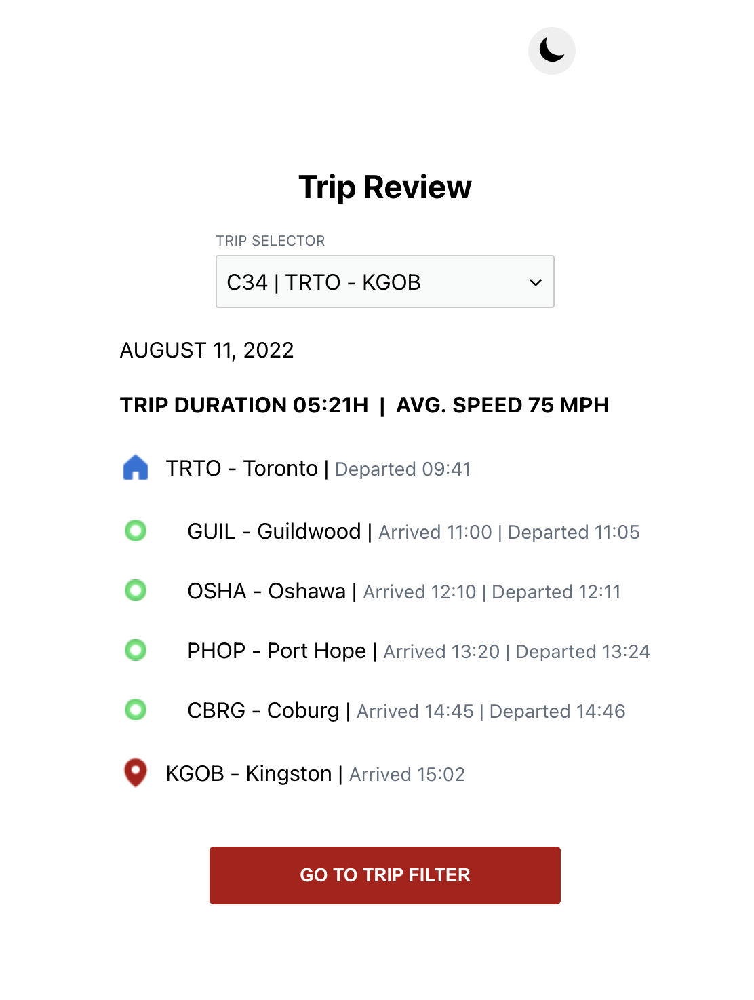
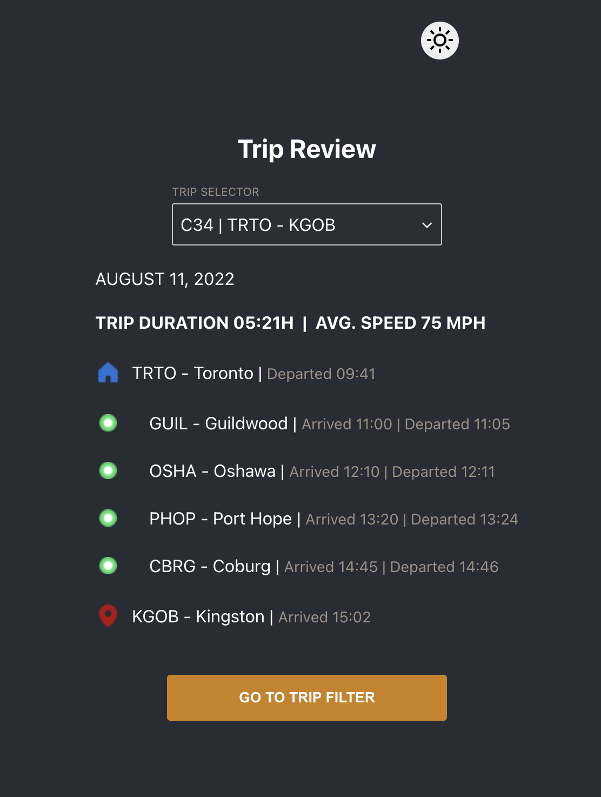
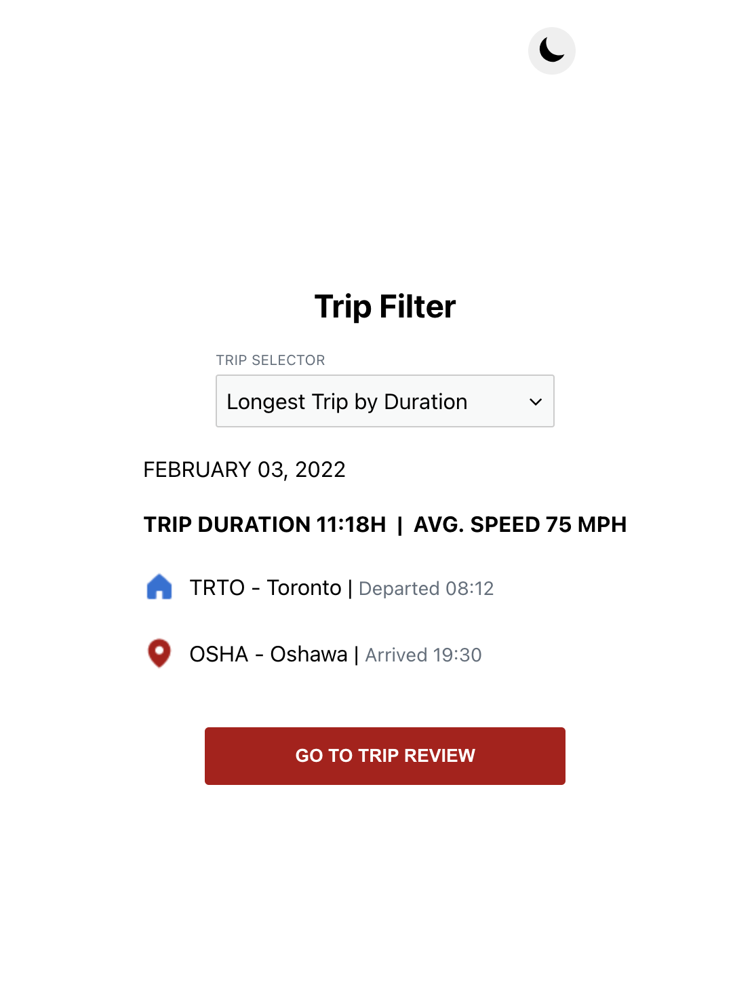
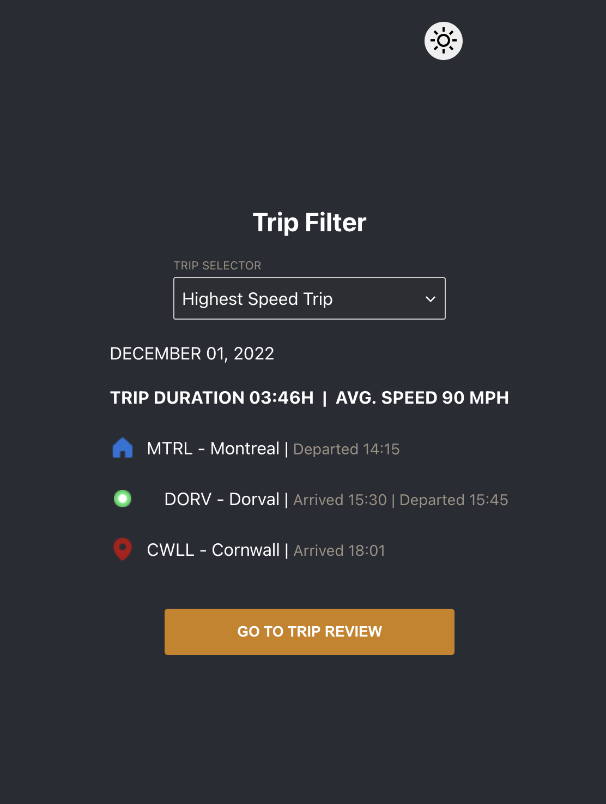
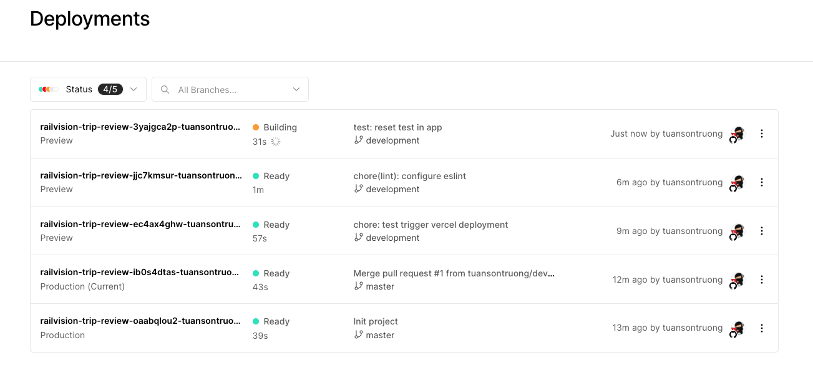
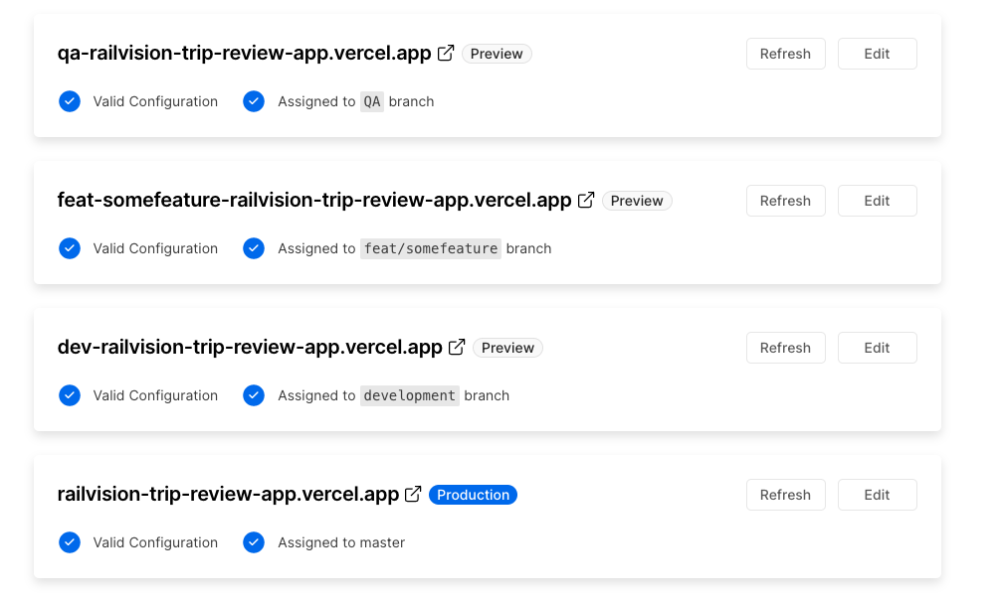
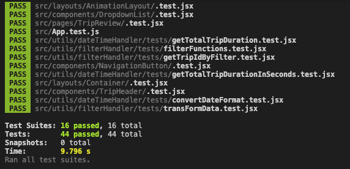

# Trip Review Web App

\*\*\* Aside from implementing the project, I also worked on other aspects including writing tests, deploy to multi-environments, documenting project structure, coding standards, etc... that we may want to have if this was a real project (please checkout this Readme).

\*\*\* **Bonus features**: Replicated the design + implemented dark mode + smooth animations

## Demo Link

https://railvision-trip-review-app.vercel.app

## Table of Contents

- [Table of Contents](#table-of-contents)
- [Project Screenshots](#project-screenshots)
- [Technologies](#technologies)
  - [Core](#core)
  - [Navigation](#navigation)
  - [Animations](#animations)
  - [Styling](#styling)
  - [State management](#state-management)
  - [Date and Time](#date-and-time)
  - [Dark/Light Mode](#darklight-mode)
  - [Testing](#testing)
  - [Hosting and Deployment](#hosting-and-deployment)
- [Project Structure](#project-structure)
- [Deployment & Environments](#deployment--environments)
- [Unit Testing](#unit-testing)
  - [Utility Testing](#utility-testing)
  - [Component Testing](#component-testing)
- [Code Formatting & Linting](#code-formatting--linting)
- [Git Workflow](#git-workflow)
- [Coding Standards](#coding-standards)
- [Change Log](#change-log)
- [Setup / Installation](#setup--installation)
- [Task Management](#task-management)

## Project Screenshots

- Trip Review - Light & Dark mode





- Trip Filter - Light & Dark mode





[Back to Table of Contents](#table-of-contents)

## Technologies

### Core

- **React.js & JavaScript ES6**

### Navigation

- **react-router-v6**: page navigation

### Animations

- **framer-motion**: Animation when transition between 2 pages
- **css animation**: Fade-in animation when display trip

### Styling

- **styled-component**: used for styling components, page layout, themes,...

### State management

- **useContext**: React hook for global state management (if we had more complex global states we will use libraries like Redux, Jotai,...)

### Date and Time

- **momentjs**: handle date and time operations

### Dark/Light Mode

- **styled components (Theme Provider)**: used to dynamically switch themes
- Use localStorage to remember the selected theme

### Testing

- **React testing library**: React component testing
- **Jest**: utility testing

### Hosting and Deployment

- **Vercel**: hosting & continuous deployment

[Back to Table of Contents](#table-of-contents)

## Project Structure

```
documentation
├── CHANGELOG.md         ---> document changes for every version release
├── git-workflow.md      ---> document git workflow to follow for this repo
├── coding-standards.md  ---> document coding standards to follow
figures                  ---> images for Readme.md
src
├── api                  ---> mock API fetch trip review data
├── assets               ---> contains images, icons, etc.
├── config
│   ├── paths
│   └── themes
├── context              ---> global state management with context provider
├── hooks                ---> reusable custom hooks (e.g API fetch)
├── layouts              ---> layout components defining structure of a page
├── components           ---> reusable/modular components used across the pages
│   ├── ComponentA
│   │   ├── index.jsx    ---> React component
│   │   ├── style.jsx    ---> styled component
        └── .test.jsx    ---> component testing
│   ├── ComponentB
│       ├── index.jsx
│       ├── style.jsx
        └── .test.jsx
│   ...
├──pages
│   ├── pageA            ---> a page of the application
│   │   ├── index.jsx
│   │   ├── style.jsx
        └── .test.jsx
│   ├── pageB
│       ├── index.jsx
│       ├── style.jsx
        └── .test.jsx
│   ...
└── utils
    ├── moduleA          ---> util module for important calculation
    │   └──tests         ---> all unit tests for each module
    │       ├── fn1.test.js
    │       ├── fn2.test.js
    │       ...
    │   └── index.jsx
    ├── moduleB
    │   ├── tests
            ├── fn1.test.js
    │       ├── fn2.test.js
            ...
    │   └── index.jsx
    ...
README.md
```

[Back to Table of Contents](#table-of-contents)

## Deployment & Environments

Deployed app with Vercel to multiple environments (master, QA, development, feature). Any new commit on a branch will trigger an automatic deployment to the corresponding environment.

- **Production**: https://railvision-trip-review-app.vercel.app
  - the production environment
- **QA**: https://qa-railvision-trip-review-app.vercel.app
  - used to test (quality assurance) before go live/merge to production
- **Development**: https://dev-railvision-trip-review-app.vercel.app
  - contains most updated features
- **Feature**: https://feat-somefeature-railvision-trip-review-app.vercel.app
  - used to develop and test a new feature




[Back to Table of Contents](#table-of-contents)

## Unit Testing

### Utility Testing

- Used Jest to test utility functions (such as getTripDuration, convertDateFormat)
- The test files are located inside the utils folder:
  - `utils / module / tests / (all test files)`
- (I wrote all the tests)

### Component Testing

- Used React testing library to test each React component
- The test files are located inside the component folder:
  - `Component / .test.jsx`
- (However, I did not write all the tests)

Run `npm test` to run all test suites:



[Back to Table of Contents](#table-of-contents)

## Code Formatting & Linting

- Use Prettier as code formatter to auto format code (on Save). Rules defined in `.prettierrc`. (to avoid conflicting formatting between developers)
- Use Eslint to find errors in code. Rules defined in `.eslintrc`

[Back to Table of Contents](#table-of-contents)

## Git Workflow

We could have a file for documenting and explaining the Git Workflow used for this project so that every developer must strictly follow:
[git-workflow.md](documentation/git-workflow.md) (it's a sample template - not written by me)

[Back to Table of Contents](#table-of-contents)

## Coding Standards

In order for every developer to follow the same consistent coding standards in the same project, we could include a coding standards/best practices file: [coding-standards.md](documentation/coding-standards.md)

[Back to Table of Contents](#table-of-contents)

## Change Log

If we release our product by versions, we could have a change log file ([CHANGELOG.MD](documentation/CHANGELOG.md)) to document all the notable changes to this project.

[Back to Table of Contents](#table-of-contents)

## Setup / Installation

`node` and `npm` (or `yarn`) are required to be installed on your machine.

Clone this repository.

Installation:

`npm install`

Run tests:

`npm test` _(will run both component and utility tests)_

Start app:

`npm start`

Visit App locally:

`localhost:3000`

[Back to Table of Contents](#table-of-contents)

## Task Management

We could also use project management tools like Trello, Jira, Rally... to manage and track tasks.

[Back to Table of Contents](#table-of-contents)
